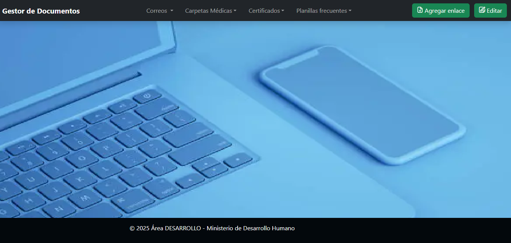

<h1 align="LEFT">
    
    Gestor de documentos
</h1>
  

Este proyecto es un gestor de documentos web diseñado con el objetivo de centralizar y facilitar la organización y acceso a documentos importantes de google Drive. Permite la gestión de enlaces a documentos y la personalización de menús desplegables para una navegación eficiente.

## Características Principales:

1. Gestión de enlaces: Permite agregar y eliminar enlaces de documentos relevantes.
2. Permite la edición de los nombres de los desplegables existentes.
3. Interfaz intuitiva: Diseño limpio y fácil de usar, enfocado en la productividad.
4. Visualización integrada: Permite visualizar documentos directamente en la aplicación.

## Tecnologías Utilizadas:

### Frontend:
- **HTML5**
- **CSS5**
- **JavaScript**
- **Bootstrap 5**

## Capturas de Pantalla

## Contacto:
Para cualquier consulta, duda o colaboración, puedes contactarme a través de los siguientes medios:
- **Email**: cosmarian@gmail.com

