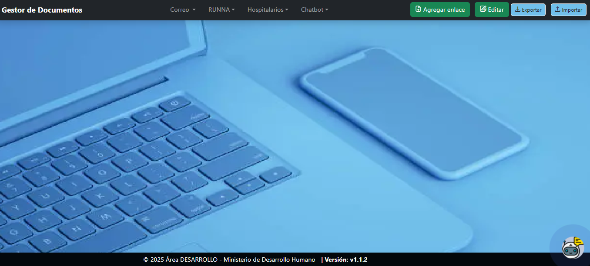

<h2 align="LEFT" style="font-size: 2.5em;">
    
    GESTOR DE DOCUMENTOS
</h2>
  

Este proyecto es un gestor de documentos web diseñado por Carla Arevalo, con el objetivo de centralizar y facilitar la organización y acceso a documentos importantes de google Drive. La versión original fue diseñada para facilitar el acceso a recursos organizativos mediante una interfaz sencilla basada en Bootstrap.
La presente versión incorpora mejoras visuales, funcionales y de experiencia de usuario, manteniendo el espíritu del desarrollo original.

##⚖️ Propiedad Intelectual
El diseño base, estructura de navegación y organización de contenidos pertenecen a Carla, quien conserva la autoría intelectual del proyecto original. Esta adaptación se realiza con fines de mejora técnica y funcional, respetando la lógica y propósito del sistema inicial.

## Características Originales
- Diseño basado en Bootstrap 5
- Organización por categorías de enlaces 
- Enlaces estáticos a documentos y plataformas externas
- Estructura HTML clara y funcional
- Uso de contenedores y columnas para disposición visual

## Adaptaciones y mejoras realizadas por mí:

- Reemplazo del diseño en columnas por una barra de navegación moderna con menús desplegables.
- Incorporación de un iframe para visualizar documentos directamente en la página, evitando abrir ventanas externas.
- Implementación de botones “Agregar enlace” y “Editar”, que permiten gestionar los contenidos de forma dinámica.
- Funcionalidad para eliminar enlaces con confirmación, directamente desde la interfaz.
- Posibilidad de editar los nombres de los menús desplegables, personalizando la navegación.
- Uso de modales personalizados para agregar y editar enlaces, mejorando la experiencia de usuario.
- Persistencia de cambios mediante localStorage, permitiendo que las personalizaciones se mantengan entre sesiones.
- Modularización del código para una estructura más limpia y mantenible.
- Incorporación de íconos visuales con Flaticon para enriquecer la interfaz.

## Características Principales de la interfaz con las mejoras realizadas:

1. Gestión de enlaces: Permite agregar y eliminar enlaces de documentos relevantes.
2. Permite la edición de los nombres de los desplegables existentes.
3. Interfaz intuitiva: Diseño limpio y fácil de usar, enfocado en la productividad.
4. Visualización integrada: Permite visualizar documentos directamente en la aplicación.

## Tecnologías Utilizadas:

### Frontend:
- **HTML5**
- **CSS3**
- **JavaScript**
- **Bootstrap 5**

## Capturas de Pantalla

## Contacto:
Para cualquier consulta, duda o colaboración, puedes contactarme a través de los siguientes medios:
- **Email**: cosmarian@gmail.com

